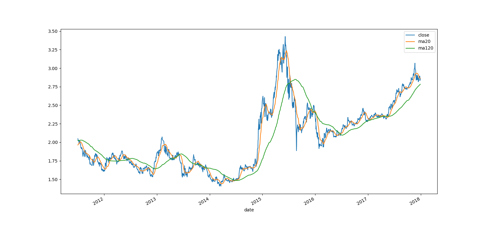
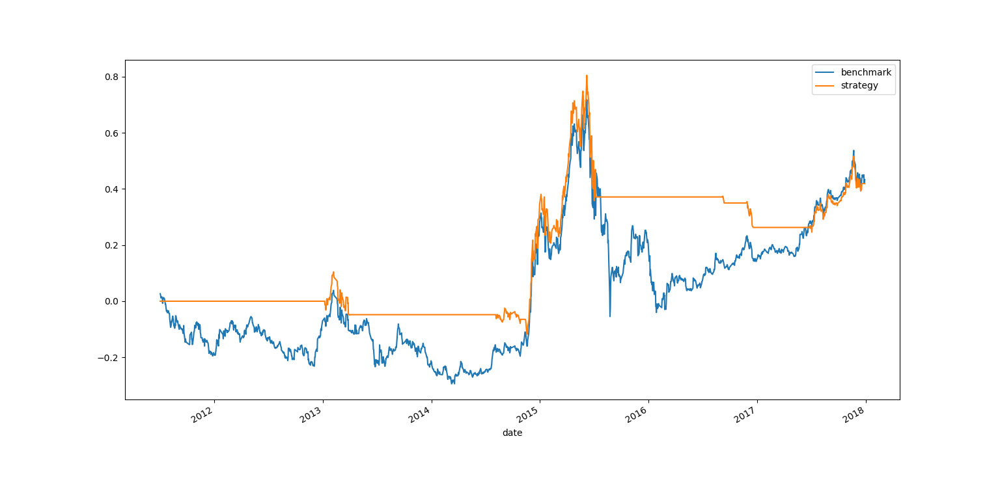

# 双均线策略

首先导入所需的库。

```py
# coding: utf-8

import numpy as np
import pandas as pd
import tushare as ts
import matplotlib.pyplot as plt
```

我使用“华夏上证50ETF”来试验。取 2011.1.1 到 2017.12.31 之间的数据。多往前取点数据，因为需要计算 MA120。

```py
df = ts.get_k_data('510050', start='20100701', end='20171231')
df.set_index(pd.DatetimeIndex(df.date), inplace=True)
df.drop('date', axis=1, inplace=True)

df.head()
'''
             open  close   high    low     volume    code
date
2011-01-04  1.987  2.009  2.018  1.978  3270052.0  510050
2011-01-05  1.997  1.993  2.006  1.989  2975378.0  510050
2011-01-06  1.995  1.980  2.005  1.973  2769546.0  510050
2011-01-07  1.980  2.000  2.031  1.966  5507308.0  510050
2011-01-10  1.998  1.973  2.014  1.971  3589159.0  510050
'''
```

计算 ROC。

```py
close_m1 = df.close.shift(1)
df['roc'] = (df.close - close_m1) / close_m1

df.head()
'''
             open  close   high    low     volume    code       roc
date
2011-01-04  1.987  2.009  2.018  1.978  3270052.0  510050       NaN
2011-01-05  1.997  1.993  2.006  1.989  2975378.0  510050 -0.007964
2011-01-06  1.995  1.980  2.005  1.973  2769546.0  510050 -0.006523
2011-01-07  1.980  2.000  2.031  1.966  5507308.0  510050  0.010101
2011-01-10  1.998  1.973  2.014  1.971  3589159.0  510050 -0.013500
'''
```

计算 MA20 和 MS120，你也可以试验其它的窗口。SMA 定义请参照指标部分。

```py
ma20 = sma(df.close, 20)
ma20 = np.append([np.nan] * 19, ma20)
df['ma20'] = ma20

ma120 = sma(df.close, 120)
ma120 = np.append([np.nan] * 119, ma120)
df['ma120'] = ma120

df.dropna(inplace=True)

df.head()
'''
             open  close   high    low     volume    code       roc     ma20  \
date
2011-07-01  2.001  1.995  2.011  1.988  1882240.0  510050 -0.001502  1.95860
2011-07-04  2.007  2.048  2.049  2.007  4154892.0  510050  0.026566  1.96270
2011-07-05  2.046  2.039  2.050  2.031  2152954.0  510050 -0.004395  1.96600
2011-07-06  2.036  2.026  2.036  2.011  2145618.0  510050 -0.006376  1.96875
2011-07-07  2.040  2.018  2.050  2.016  2740925.0  510050 -0.003949  1.97255

               ma120
date
2011-07-01  2.022592
2011-07-04  2.022917
2011-07-05  2.023300
2011-07-06  2.023683
2011-07-07  2.023833
'''
```

绘制收盘价、MA20 和 MA120，大家可以看出点规律了。

```py
df[['close', 'ma20', 'ma120']].plot()
plt.show()
```



下面是我们的策略。如果 MA20 比 MA120 大 5% 或以上，就买入，否则卖出。5% 是阈值，防止频繁买卖，你也可以试验其它的。


```py
signal = (df.ma20 - df.ma120 > df.ma120 * 0.05).astype(int)
```

`signal`是买入或者卖出信号，它是连续的 01 数组。由于我们拿到某一天的收盘价，判断之后，下一天才可以操作，所以后移一天。

```py
df['signal'] = signal.shift(1)
df.dropna(inplace=True)

df.head()
'''
             open  close   high    low     volume    code       roc     ma20  \
date
2011-07-04  2.007  2.048  2.049  2.007  4154892.0  510050  0.026566  1.96270
2011-07-05  2.046  2.039  2.050  2.031  2152954.0  510050 -0.004395  1.96600
2011-07-06  2.036  2.026  2.036  2.011  2145618.0  510050 -0.006376  1.96875
2011-07-07  2.040  2.018  2.050  2.016  2740925.0  510050 -0.003949  1.97255
2011-07-08  2.020  2.027  2.037  2.014  2566631.0  510050  0.004460  1.97655

               ma120  signal
date
2011-07-04  2.022917     0.0
2011-07-05  2.023300     0.0
2011-07-06  2.023683     0.0
2011-07-07  2.023833     0.0
2011-07-08  2.024283     0.0
'''
```

然后计算基准收益和策略收益：

```py
df['benchmark'] = (df.roc + 1).cumprod() - 1
df['strategy'] = (df.roc * df.signal + 1).cumprod() - 1

df.head()
'''
             open  close   high    low     volume    code       roc     ma20  \
date
2011-07-04  2.007  2.048  2.049  2.007  4154892.0  510050  0.026566  1.96270
2011-07-05  2.046  2.039  2.050  2.031  2152954.0  510050 -0.004395  1.96600
2011-07-06  2.036  2.026  2.036  2.011  2145618.0  510050 -0.006376  1.96875
2011-07-07  2.040  2.018  2.050  2.016  2740925.0  510050 -0.003949  1.97255
2011-07-08  2.020  2.027  2.037  2.014  2566631.0  510050  0.004460  1.97655

               ma120  signal  benchmark  strategy
date
2011-07-04  2.022917     0.0   0.026566       0.0
2011-07-05  2.023300     0.0   0.022055       0.0
2011-07-06  2.023683     0.0   0.015539       0.0
2011-07-07  2.023833     0.0   0.011529       0.0
2011-07-08  2.024283     0.0   0.016040       0.0
'''
```

最后绘制两个受益的曲线。

```py
df[['benchmark', 'strategy']].plot()
plt.show()
```


