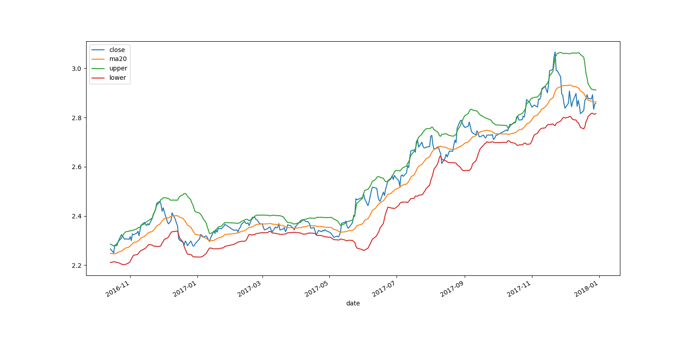
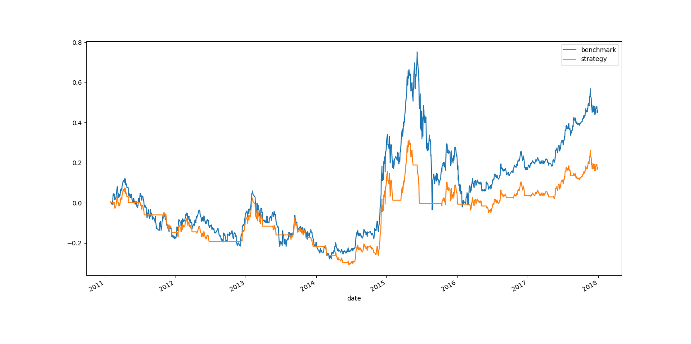

# 布林带策略

首先导入所需的库。

```py
# coding: utf-8

import numpy as np
import pandas as pd
import tushare as ts
import matplotlib.pyplot as plt
```

使用“华夏上证50ETF”。取 2011.1.1 到 2017.12.31 之间的数据。多往前取一个月

```py
df = ts.get_k_data('510050', start='20101201', end='20171231')
df.set_index(pd.DatetimeIndex(df.date), inplace=True)
df.drop('date', axis=1, inplace=True)

df.head()
'''
             open  close   high    low     volume    code
date
2011-01-04  1.987  2.009  2.018  1.978  3270052.0  510050
2011-01-05  1.997  1.993  2.006  1.989  2975378.0  510050
2011-01-06  1.995  1.980  2.005  1.973  2769546.0  510050
2011-01-07  1.980  2.000  2.031  1.966  5507308.0  510050
2011-01-10  1.998  1.973  2.014  1.971  3589159.0  510050
'''
```

计算 ROC。

```py
close_m1 = df.close.shift(1)
df['roc'] = (df.close - close_m1) / close_m1

df.head()
'''
             open  close   high    low     volume    code       roc
date
2011-01-04  1.987  2.009  2.018  1.978  3270052.0  510050       NaN
2011-01-05  1.997  1.993  2.006  1.989  2975378.0  510050 -0.007964
2011-01-06  1.995  1.980  2.005  1.973  2769546.0  510050 -0.006523
2011-01-07  1.980  2.000  2.031  1.966  5507308.0  510050  0.010101
2011-01-10  1.998  1.973  2.014  1.971  3589159.0  510050 -0.013500
'''
```

计算两条布林带，窗口为 20，代码请见指标部分。

```py
upper, lower = boll(df['close'], 20)
upper = np.append([np.nan] * 19, upper)
lower = np.append([np.nan] * 19, lower)

df['upper'] = upper
df['lower'] = lower
df['ma20'] = (upper + lower) / 2

df.dropna(inplace=True)

df.head()
'''
             open  close   high    low     volume    code       roc     upper  \
date
2011-01-31  1.937  1.956  1.959  1.936  2098646.0  510050  0.009288  2.034408
2011-02-01  1.959  1.964  1.967  1.953  1849888.0  510050  0.004090  2.028188
2011-02-09  1.950  1.936  1.970  1.935  2800716.0  510050 -0.014257  2.023253
2011-02-10  1.937  1.969  1.972  1.929  3241989.0  510050  0.017045  2.021919
2011-02-11  1.964  1.968  1.976  1.960  2323059.0  510050 -0.000508  2.016965

               lower     ma20
date
2011-01-31  1.876192  1.95530
2011-02-01  1.877912  1.95305
2011-02-09  1.877147  1.95020
2011-02-10  1.877381  1.94965
2011-02-11  1.879135  1.94805
'''
```

绘制收盘价、均线、两条布林带。由于图像实在太密，看不出来什么，取最后的 300 天来画。

```py
df.iloc[-300:][['close', 'ma20', 'upper', 'lower']].plot()
plt.show()
```



布林带策略是，收盘价大于上线则买入，小于下线则卖出。如果在两条线之间，就跟随上一个信号。

```py
upper = df['upper']
lower = df['lower']
close = df['close']

signal = (close > upper) * 1 + ((close >= lower) & (close <= upper)) * (-1)

initial = 0
for i in range(signal.size):
    if signal[i] == -1:
        signal[i] = initial
    else:
        initial = signal[i]

df['signal'] = signal.shift(1)
df.dropna(inplace=True)

df.head()
'''
             open  close   high    low     volume    code       roc     upper  \
date
2011-02-01  1.959  1.964  1.967  1.953  1849888.0  510050  0.004090  2.028188
2011-02-09  1.950  1.936  1.970  1.935  2800716.0  510050 -0.014257  2.023253
2011-02-10  1.937  1.969  1.972  1.929  3241989.0  510050  0.017045  2.021919
2011-02-11  1.964  1.968  1.976  1.960  2323059.0  510050 -0.000508  2.016965
2011-02-14  1.970  2.041  2.049  1.970  6377369.0  510050  0.037093  2.031378

               lower     ma20  signal
date
2011-02-01  1.877912  1.95305     0.0
2011-02-09  1.877147  1.95020     0.0
2011-02-10  1.877381  1.94965     0.0
2011-02-11  1.879135  1.94805     0.0
2011-02-14  1.871522  1.95145     0.0
'''
```

接下来计算基准收益和策略收益：

```py
df['benchmark'] = (df.roc + 1).cumprod() - 1
df['strategy'] = (df.roc * df.signal + 1).cumprod() - 1

df.head()
'''
             open  close   high    low     volume    code       roc     upper  \
date
2011-02-01  1.959  1.964  1.967  1.953  1849888.0  510050  0.004090  2.028188
2011-02-09  1.950  1.936  1.970  1.935  2800716.0  510050 -0.014257  2.023253
2011-02-10  1.937  1.969  1.972  1.929  3241989.0  510050  0.017045  2.021919
2011-02-11  1.964  1.968  1.976  1.960  2323059.0  510050 -0.000508  2.016965
2011-02-14  1.970  2.041  2.049  1.970  6377369.0  510050  0.037093  2.031378

               lower     ma20  signal  benchmark  strategy
date
2011-02-01  1.877912  1.95305     0.0   0.004090       0.0
2011-02-09  1.877147  1.95020     0.0  -0.010225       0.0
2011-02-10  1.877381  1.94965     0.0   0.006646       0.0
2011-02-11  1.879135  1.94805     0.0   0.006135       0.0
2011-02-14  1.871522  1.95145     0.0   0.043456       0.0
'''
```

最后绘制两个收益的曲线。

```py
df[['benchmark', 'strategy']].plot()
plt.show()
```



表现有些不好。
